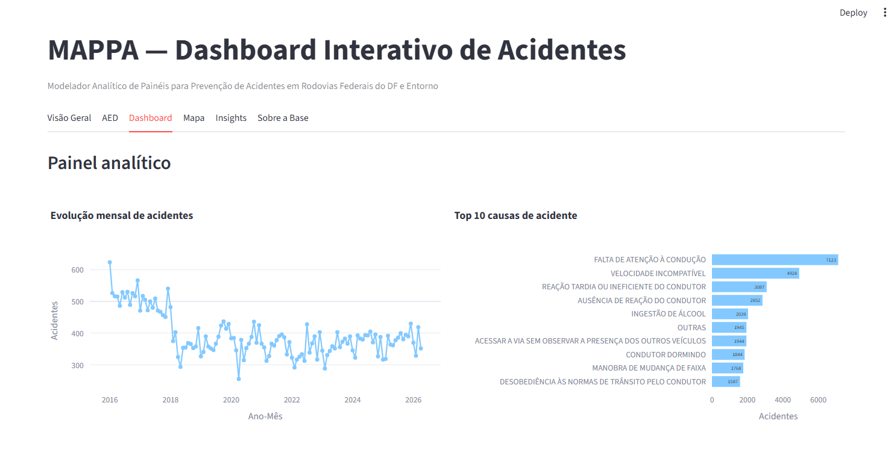

# 🚧 Projeto Integrador I - MAPPA
## 📊 Estudo de Acidentes de Trânsito em Rodovias Federais

---

📍 Foco no **Distrito Federal (DF)** e regiões do entorno.  
📈 Identificação de padrões, tendências e fatores de risco.  

---

## 📸 Preview do Projeto

---

## 📌 Sobre o Projeto

Este projeto do curso de ciência da computação tem como objetivo estudar as ocorrências de acidentes de trânsito em **rodovias federais**, com ênfase nas conexões do **Distrito Federal** com cidades do entorno e outros estados.

A iniciativa utiliza técnicas de **análise de dados** como ferramenta de estudo, para identificar padrões e gerar insights que possam contribuir para a melhoria da segurança viária.

---

## 🎯 Objetivos

### 🧩 Objetivo Geral
Desenvolver um dashboard interativo que tenha como base a **coleta, análise e visualização de dados** de acidentes de trânsito.

### 📍 Objetivos Específicos

- 📥 Coletar dados de fontes confiáveis  
- 🧹 Tratar e organizar os dados  
- 🔍 Identificar padrões e tendências  
- ⚠️ Analisar fatores de risco  
- 📊 Criar visualizações intuitivas  
- 🖥️ Desenvolver um **dashboard interativo**  

---

## 💡 Impacto Esperado

Este projeto: Tem como meta desenvolver uma ferramenta baseada nos estudos realizados, que otimize as atividades e avaliações de profissionais de segurança viária.

Pode auxiliar:
- 🏛️ **Gestores públicos** na tomada de decisão  
- 📚 **Pesquisadores** em estudos de mobilidade  
- 🚗 **Sociedade** na conscientização sobre acidentes  

---

## 👥 Equipe

| Nome | Função | GitHub |
|------|------|------|
| VICTOR ALVES RIBEIRO FERNANDES | P.O DO PROJETO | [@VictorFerna](https://github.com/VictorFerna) |
| LUCAS HENRIQUE MONTEIRO | ARQUITETO | [@Lucasmonnteiro](https://github.com/Lucasmonnteiro) |
| DANILO LISBOA BARCELOS | ANALISTA DE DADOS | [@Danilo698](https://github.com/Danilo698) |
| IGOR CAVALCANTE RODRIGUES | SCRUM MASTER | [@igorcavalcantee](https://github.com/igorcavalcantee) |
| JOÃO VITOR VELOZO OLIVEIRA | ADMINISTRADOR BANCO DE DADOS | [@Jvvelozo](https://github.com/Jvvelozo) |
---

## 🗂️ Estrutura do Repositório

- **📚 Docs/imagnes/Un1/Un2/Un3/Un4/Un5:**
- **📄 Estrutura_Do_Repositorio.txt:**
- **📄 README.md:**

---

## 📊 Status do Projeto

🟡 Em desenvolvimento

